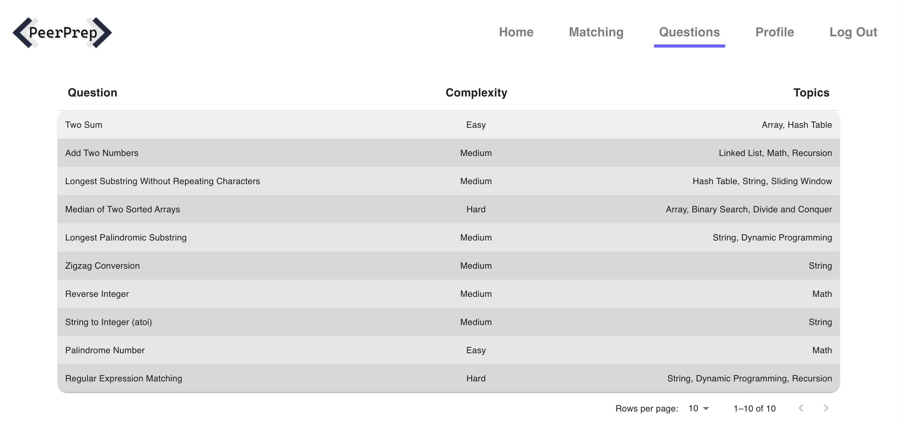

# ServerlessTemplate

This repository contains our serverless function used in cloud function for assignment 6.

## Cloud Function
Uses Graphql and Python requests to get leetcode questions and store it as our mongoose question model in mongoDB.

### Running the script locally
1) Create .env file in root
___
.env file variable

MONGO_URI=mongodb+srv://{username}:{password}@{clusterid}.3w1nmj1.mongodb.net/{dbname}?retryWrites=true&w=majority
___
2) Run in terminal `pip install pipenv`
3) `pipenv shell`
4) `pipenv install -r requirements.txt`
5) `python3 main.py <limit>`
___

For instance, the above instance resets our database and puts in 10 questions.
___
6) `exit`

### Deployed function
For 10 questions

To change the number of questions, change the value after `limit=`

- https://asia-northeast2-cs3219-group6-400112.cloudfunctions.net/put-questions?limit=10

For all questions (longer waiting time)

- https://asia-northeast2-cs3219-group6-400112.cloudfunctions.net/put-questions

### Verification

[Website](https://fe-cd-test-a2rwifv3ta-dt.a.run.app/)

username: serverless

password: serverless

